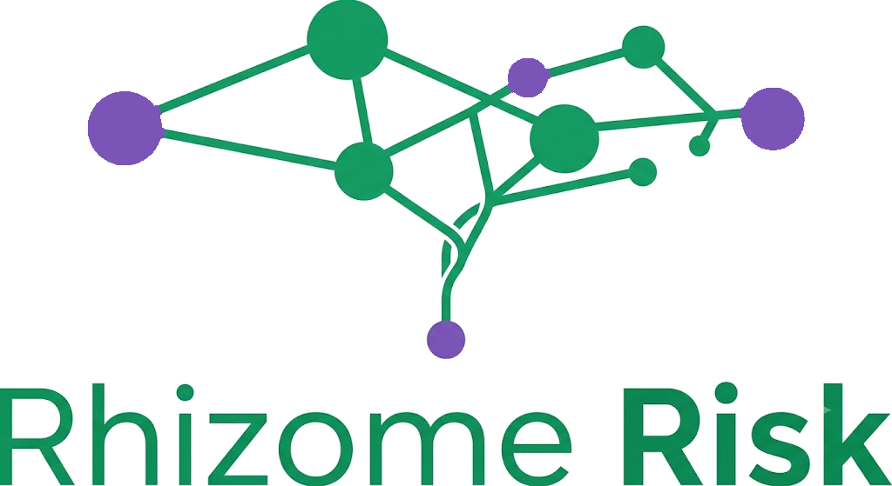

  

**Rhizome Risk** is a suite of interconnected backend and AI systems built to catch fraud and compliance risk in financial transactions and SaaS account activity, while keeping every AI-generated judgment inside a hard boundary a human or deterministic rule can override.

**What it does**

```mermaid
%%{init: {'themeVariables': {'fontSize': '10px'}, 'flowchart': {'nodeSpacing': 15, 'rankSpacing': 25}}}%%
flowchart LR
    EH[EventHorizon]
    XY[Xylem-L6]
    SL[synapse-l4]
    AR[arbiter-L8<br/>external eval harness]
    SentinelL7[sentinel-l7]
    LE[Ledger-L5]
    RL[Rhizome-Lens]

    SL ~~~ AR

    EH -->|Telemetry Events| SL
    XY -->|SaaS Activity| SL
    SL -->|Validated Axioms| SentinelL7
    SentinelL7 -->|Usage Events| LE
    SentinelL7 -->|OTel Traces/Logs| RL
    AR -->|HTTP POST /ingest| SL
    AR -->|MCP: analyze-transaction| SentinelL7
    AR -->|OTel Metrics/Traces| RL

    click EH "https://github.com/obrienma/EventHorizon#readme" "Go to EventHorizon repo"
    click XY "https://github.com/obrienma/Xylem-L6#readme" "Go to Xylem-L6 repo"
    click SL "https://github.com/obrienma/synapse-l4#readme" "Go to synapse-l4 repo"
    click AR "https://github.com/obrienma/Arbiter-L8#readme" "Go to arbiter-L8 repo"
    click SentinelL7 "https://github.com/obrienma/sentinel-l7#readme" "Go to sentinel-l7 repo"
    click LE "https://github.com/obrienma/Ledger-L5#readme" "Go to Ledger-L5 repo"
    click RL "https://github.com/obrienma/Rhizome-Lens#readme" "Go to Rhizome-Lens repo"

    classDef clickable fill:#1d4ed8,stroke:#1e40af,stroke-width:2px,color:#ffffff
    class EH,XY,SL,AR,SentinelL7,LE,RL clickable
```

-   **[Sentinel-L7](https://github.com/obrienma/sentinel-l7#readme)** (PHP/Laravel) is the compliance engine at the center: a three-tier pipeline — semantic cache, then LLM+RAG reasoning, then a rule-based fallback — that evaluates transactions against policy. It runs on Redis Streams consumer groups and exposes an MCP server for direct querying.
-   **[Synapse-L4](https://github.com/obrienma/synapse-l4#readme)** (Python/FastAPI) is a sidecar that consumes telemetry, extracts and evaluates it, and emits typed, contract-enforced events — the boundary that keeps LLM output from reaching downstream systems unchecked.
-   **[EventHorizon](https://github.com/obrienma/EventHorizon#readme)** (TypeScript/Fastify) is the telemetry pipeline: ingestion through processing, storage, and observation, backed by RabbitMQ and MongoDB, deployed on GKE.
-   **[Xylem-L6](https://github.com/obrienma/Xyleme-L8#readme)** (TypeScript/Zod) ingests SaaS API activity and evaluates it for credential stuffing, impossible travel, and scope escalation using hand-built sliding-window velocity checks and per-identity state — no framework shortcuts.
-   **[Arbiter-L8](https://github.com/obrienma/arbiter-l8#readme)** (Python) is the evaluation harness: offline precision/recall/F1 against fixtures, plus an online cost-ordered pipeline that escalates from heuristics through cross-provider disagreement checks to an LLM judge only when needed.
-   **[Ledger-L5](https://github.com/obrienma/Ledger-L5#readme)** (Python/FastAPI) handles usage-based billing off Sentinel-L7 activity — early stages.
-   **[Rhizome-Lens](https://github.com/obrienma/Rhizome-Lens)** is the shared observability layer: a self-hosted OTel Collector feeding Tempo, Loki, and Prometheus, visualized in Grafana.

**Architectural discipline**

Every phase is decided before it's built: architecture decision records are written and accepted before implementation starts, and once accepted they're never edited — only reversed by a new ADR. Speculative infrastructure isn't built ahead of need. The thesis running through all of it: the LLM reasons, it never owns the decision.
