  

**Rhizome Risk** is an interconnected system of backend and AI services, built to demonstrate production patterns for asynchronous message processing, semantic caching, retrieval-augmented generation, and automated LLM evaluation. Fraud and compliance risk detection is the domain used to prove the architecture — evaluating event streams (financial transactions, API activity, raw system telemetry) for risk while keeping every AI-generated judgment inside a hard boundary a human or deterministic rule can override — but the architecture itself is domain-agnostic.

> **The thesis running through every service:** the LLM reasons, it never owns the decision. Every AI-generated risk judgment passes through a deterministic rule or a human-reviewable override before it can affect an outcome.

## **Further reading**
- [Closing the Loop: What We Actually Shipped from the Roadmap](https://cyberrhizome.ca/blog/10-closing-the-loop-what-we-shipped)
- [Triple-Defense Idempotency in a Crash-Prone Event Stream](https://cyberrhizome.ca/blog/09-triple-defense-idempotency)
- [GraphQL Over Four Planes: An ADR That Contradicted Itself](https://cyberrhizome.ca/blog/event-horizon-2026-07-06-graphql-and-the-n-plus-1-we-measured)
- [all writing →](https://cyberrhizome.ca/blog)

---

## **Evaluation**
[Arbiter-L8](https://github.com/obrienma/Arbiter-L8) scores every AI-generated verdict against labeled ground truth and live traffic. Live-verified: Sentinel-L7 and its LLM judge layer both score 92% binary accuracy against a 25-item sample. Full methodology, caveats, and sample composition in Arbiter-L8's own README.

---

## **Observability**
[Rhizome Lens](https://github.com/obrienma/rhizome-lens#readme) is the shared Grafana stack EventHorizon, Synapse-L4, Sentinel-L7, and Arbiter-L8 export traces and metrics to via OTLP.

  

---

**Sentinel-L7**, still a monolith with services upstream and downstream of it, has its own operational console for reviewing flagged transactions and case actions:

  
  

## **Under the hood**

```mermaid
%%{init: {'themeVariables': {'fontSize': '10px'}, 'flowchart': {'nodeSpacing': 15, 'rankSpacing': 25}}}%%
flowchart LR
    EH[EventHorizon]
    XY[Xylem-L6]
    SL[synapse-l4]
    AR[arbiter-L8<br/>external eval harness]
    SentinelL7[sentinel-l7]
    LE[Ledger-L5]
    RL[Rhizome-Lens]

    SL ~~~ AR

    EH -->|Telemetry Events| SL
    XY -->|SaaS Activity| SL
    SL -->|Validated Axioms| SentinelL7
    SentinelL7 -->|Usage Events| LE
    SentinelL7 -->|OTel Traces/Logs| RL
    AR -->|HTTP POST /ingest| SL
    AR -->|MCP: analyze-transaction| SentinelL7
    AR -->|OTel Metrics/Traces| RL

    click EH "https://github.com/obrienma/EventHorizon#readme" "Go to EventHorizon repo"
    click XY "https://github.com/obrienma/Xylem-L6#readme" "Go to Xylem-L6 repo"
    click SL "https://github.com/obrienma/synapse-l4#readme" "Go to synapse-l4 repo"
    click AR "https://github.com/obrienma/Arbiter-L8#readme" "Go to arbiter-L8 repo"
    click SentinelL7 "https://github.com/obrienma/sentinel-l7#readme" "Go to sentinel-l7 repo"
    click LE "https://github.com/obrienma/Ledger-L5#readme" "Go to Ledger-L5 repo"
    click RL "https://github.com/obrienma/Rhizome-Lens#readme" "Go to Rhizome-Lens repo"

    classDef clickable fill:#1d4ed8,stroke:#1e40af,stroke-width:2px,color:#ffffff
    class EH,XY,SL,AR,SentinelL7,LE,RL clickable
```

-   **[Sentinel-L7](https://github.com/obrienma/sentinel-l7#readme)** (PHP/Laravel) is the compliance engine at the center: a three-tier pipeline — semantic cache, then LLM+RAG reasoning, then a rule-based fallback — that evaluates transactions against policy. It runs on Redis Streams consumer groups and exposes an MCP server for direct querying.
-   **[Synapse-L4](https://github.com/obrienma/synapse-l4#readme)** (Python/FastAPI) is a sidecar that consumes telemetry, extracts and evaluates it, and emits typed, contract-enforced events — the boundary that keeps LLM output from reaching downstream systems unchecked.
-   **[EventHorizon](https://github.com/obrienma/EventHorizon#readme)** (TypeScript/Fastify) is the telemetry pipeline: ingestion through processing, storage, and observation, backed by RabbitMQ and MongoDB, deployed on GKE.
-   **[Xylem-L6](https://github.com/obrienma/Xylem-L6#readme)** (TypeScript/Zod) ingests SaaS API activity and evaluates it for credential stuffing, impossible travel, and scope escalation using hand-built sliding-window velocity checks and per-identity state — no framework shortcuts.
-   **[Arbiter-L8](https://github.com/obrienma/arbiter-l8#readme)** (Python) is the evaluation harness: offline precision/recall/F1 against fixtures, plus an online cost-ordered pipeline that escalates from heuristics through cross-provider disagreement checks to an LLM judge only when needed.
-   **[Ledger-L5](https://github.com/obrienma/Ledger-L5#readme)** (Python/FastAPI) handles usage-based billing off Sentinel-L7 activity — early stages.
-   **[Rhizome-Lens](https://github.com/obrienma/Rhizome-Lens)** is the shared observability layer: a self-hosted OTel Collector feeding Tempo, Loki, and Prometheus, visualized in Grafana.

## **Engineering priorities, and how they relate**

Six quality attributes drive the design across the suite, and they're not independent — three pairs share a mechanism.

*Observability underpins reliability and resilience.* You can't be reliable or resilient about failures you can't see. Rhizome-Lens (OTel → Tempo/Loki/Prometheus) is the shared substrate under both: the same traces that show a system degrading are what let a resilience mechanism — retry, fallback tier — decide when to engage.

Reliability and resilience are related but not the same axis. Reliability means the system does the correct thing consistently. Resilience is what happens when it doesn't — whether it degrades gracefully or falls over. Sentinel-L7's three-tier fallback (semantic cache → LLM+RAG → rule-based) is resilience in practice: it's the answer to "the reliable path failed, now what."

*Testability underpins maintainability and extendability.* All three come from the same source: well-isolated boundaries. A component that's decoupled enough to test in isolation is, by the same property, decoupled enough to maintain and extend later. The Sentinel `Logic` namespace boundary is a concrete instance — an arch-test-enforced boundary for pure decision logic, kept isolated from the rest of the application specifically so it stays testable and safe to extend.

Security and scalability cut across the other four, and sometimes trade off against them. Security overlaps with reliability — an exploited system isn't a reliable one — but tighter security boundaries add friction to extending a system. Scalability shares mechanism with resilience (statelessness, backpressure, horizontal scaling), but pursued prematurely it works against maintainability — which is why "wait until it hurts" functions as both a scalability and a maintainability principle here, not just a deferral habit.

## **Architectural discipline**

Every phase is decided before it's built: architecture decision records are written and accepted before implementation starts, and once accepted they're never edited — only reversed by a new ADR. Speculative infrastructure isn't built ahead of need. The thesis running through all of it: the LLM reasons, it never owns the decision.