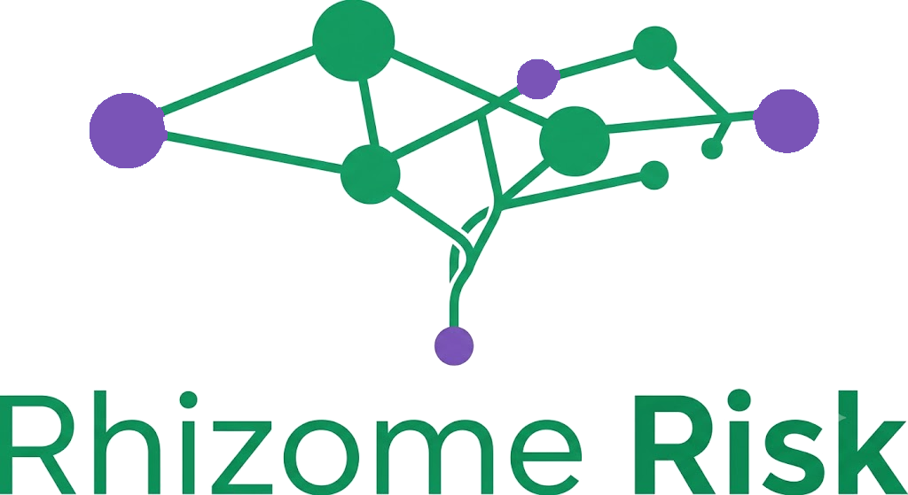

  

**The LLM reasons. It never owns the decision.**

Rhizome Risk is a system of backend and AI services for catching fraud and compliance risk in financial transactions and SaaS account activity. Every AI-generated judgment passes through a deterministic rule or a human-reviewable override before it can affect an outcome. Fraud and compliance are the proving ground; the architecture is domain-agnostic.

## The problem

Put an LLM in the path of a risk call with nothing underneath it, and a wrong answer, a drifted model, or an odd input goes straight to a real outcome: a frozen account, a missed fraud pattern, a compliance violation.

## The approach

The model reasons about the case and produces a recommendation. A deterministic rule or a person makes the call. The reasoning is logged and overridable, and an evaluation harness scores verdicts against labeled ground truth instead of assuming they hold up.

## One case, end to end

A SaaS login arrives with an impossible-travel pattern: two logins from different continents, minutes apart.

1.  **Xylem-L6** detects it with deterministic velocity checks over per-identity state. No model is involved.
2.  **Synapse-L4** validates the event against a typed contract before anything downstream sees it.
3.  **Sentinel-L7** evaluates it against policy: semantic cache, then LLM reasoning grounded in retrieved policy, then a rule-based fallback. The output is a recommendation, not an action.
4.  **A person or a deterministic rule makes the final call.** The reasoning is visible and overridable.
5.  **Arbiter-L8** scores Sentinel-L7's verdicts against labeled ground truth, so reliability is a number rather than an assertion. Current results are under [Evaluation](https://claude.ai/chat/8fe9a488-034d-4e6c-9980-89e78cd4edab#evaluation).
6.  **Ledger-L5** meters the usage event Sentinel-L7 emits for each evaluation, feeding usage-based billing.

### Human review

Sentinel-L7 has its own operational console for reviewing flagged transactions and case actions.

   

## Services

The split follows the trust boundaries that matter most: detecting a signal, gating what reaches the model, and letting the model reason inside a fence. Each can be tested and reasoned about on its own.

| Service | Stack | Role |
| --- | --- | --- |
| **[Sentinel-L7](https://github.com/obrienma/sentinel-l7#readme)** | PHP/Laravel | Compliance engine. Three-tier evaluation (semantic cache, LLM + RAG, rule-based fallback) on Redis Streams consumer groups. Exposes an MCP server for direct querying. |
| **[Synapse-L4](https://github.com/obrienma/synapse-l4#readme)** | Python/FastAPI | Sidecar that consumes telemetry and emits typed, contract-enforced events. The boundary that keeps LLM output from reaching downstream systems unchecked. |
| **[EventHorizon](https://github.com/obrienma/EventHorizon#readme)** | TypeScript/Fastify | Telemetry pipeline: ingestion, processing, storage, observation. RabbitMQ and MongoDB, deployed on GKE. |
| **[Xylem-L6](https://github.com/obrienma/Xylem-L6#readme)** | TypeScript/Zod | SaaS activity evaluation for credential stuffing, impossible travel, and scope escalation. Sliding-window velocity checks, per-identity state, and watermarked late-event handling, implemented directly. |
| **[Arbiter-L8](https://github.com/obrienma/Arbiter-L8#readme)** | Python | Evaluation harness. Offline precision/recall/F1 against fixtures; online scoring that escalates from heuristics to cross-provider disagreement checks, and to an LLM judge only when needed. |
| **[Ledger-L5](https://github.com/obrienma/Ledger-L5#readme)** | Python/FastAPI | Usage-based billing off Sentinel-L7 activity. |
| **[Rhizome-Lens](https://github.com/obrienma/Rhizome-Lens#readme)** | OTel, Grafana | Shared observability: a self-hosted OTel Collector feeding Tempo, Loki, and Prometheus. |

## Architecture

```mermaid
%%{init: {'themeVariables': {'fontSize': '10px'}, 'flowchart': {'nodeSpacing': 15, 'rankSpacing': 25}}}%%
flowchart LR
    EH[EventHorizon]
    XY[Xylem-L6]
    SL[Synapse-L4<br/>Validation]
    AR[Arbiter-L8<br/>External Eval Harness]
    SentinelL7[Sentinel-L7<br/>Compliance Engine]
    LE[Ledger-L5<br/>Billing]
    RL[Rhizome-Lens<br/>Observability]

    SL ~~~ AR

    EH -->|Telemetry Events| SL
    XY -->|SaaS Activity| SL
    SL -->|Validated Axioms| SentinelL7
    SentinelL7 -->|Usage Events| LE
    SentinelL7 -->|OTel Traces/Logs| RL
    AR -->|HTTP POST /ingest| SL
    AR -->|MCP: analyze-transaction| SentinelL7
    AR -->|OTel Metrics/Traces| RL

    click EH "https://github.com/obrienma/EventHorizon#readme" "Go to EventHorizon repo"
    click XY "https://github.com/obrienma/Xylem-L6#readme" "Go to Xylem-L6 repo"
    click SL "https://github.com/obrienma/synapse-l4#readme" "Go to Synapse-L4 repo"
    click AR "https://github.com/obrienma/Arbiter-L8#readme" "Go to Arbiter-L8 repo"
    click SentinelL7 "https://github.com/obrienma/sentinel-l7#readme" "Go to Sentinel-L7 repo"
    click LE "https://github.com/obrienma/Ledger-L5#readme" "Go to Ledger-L5 repo"
    click RL "https://github.com/obrienma/Rhizome-Lens#readme" "Go to Rhizome-Lens repo"

    classDef clickable fill:#1d4ed8,stroke:#1e40af,stroke-width:2px,color:#ffffff
    class EH,XY,SL,AR,SentinelL7,LE,RL clickable
```

## Evaluation

[Arbiter-L8](https://github.com/obrienma/Arbiter-L8#readme) scores every AI-generated verdict against labeled ground truth and live traffic, cheapest check first and LLM judge last.

Live-verified: Sentinel-L7 and its LLM judge layer both score 92% binary accuracy against a 25-item sample. That is a small sample, so read it as an early checkpoint, not a reliability claim. Methodology and sample composition are in Arbiter-L8's README.

## Observability

[Rhizome-Lens](https://github.com/obrienma/Rhizome-Lens#readme) is the shared Grafana stack. EventHorizon, Synapse-L4, Sentinel-L7, and Arbiter-L8 export traces and metrics to it via OTLP.

    <em>EventHorizon: RED metrics and distributed traces</em> 

## How decisions are made

Every non-trivial decision is recorded in an Architectural Decision Record (ADR) before it's built. Accepted ADRs are never edited, only reversed by a later one, so the reasoning behind the current design stays recoverable. Speculative complexity is deferred until the cost of not having it shows up.

Observability and testability come first, because they buy reliability, resilience, maintainability, and extendability. Security and scalability cut across all of it. These pull against each other: tightening security adds friction to extension, and scaling early works against maintainability. The ADRs are where each trade is made explicit.

## Further reading

-   [Closing the Loop: What We Actually Shipped from the Roadmap](https://cyberrhizome.ca/blog/10-closing-the-loop-what-we-shipped)
-   [Triple-Defense Idempotency in a Crash-Prone Event Stream](https://cyberrhizome.ca/blog/09-triple-defense-idempotency)
-   [GraphQL Over Four Planes: An ADR That Contradicted Itself](https://cyberrhizome.ca/blog/event-horizon-2026-07-06-graphql-and-the-n-plus-1-we-measured)
-   [All writing](https://cyberrhizome.ca/blog)